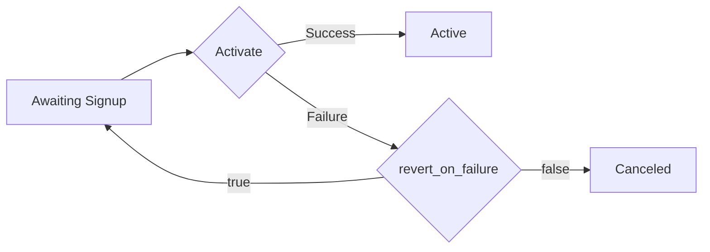

# Subscriptions

```go
subscriptionsController := client.SubscriptionsController()
```

## Class Name

`SubscriptionsController`

## Methods

* [Create Subscription](../../doc/controllers/subscriptions.md#create-subscription)
* [List Subscriptions](../../doc/controllers/subscriptions.md#list-subscriptions)
* [Update Subscription](../../doc/controllers/subscriptions.md#update-subscription)
* [Read Subscription](../../doc/controllers/subscriptions.md#read-subscription)
* [Override Subscription](../../doc/controllers/subscriptions.md#override-subscription)
* [Read Subscription by Reference](../../doc/controllers/subscriptions.md#read-subscription-by-reference)
* [Purge Subscription](../../doc/controllers/subscriptions.md#purge-subscription)
* [Create Prepaid Subscription](../../doc/controllers/subscriptions.md#create-prepaid-subscription)
* [Preview Subscription](../../doc/controllers/subscriptions.md#preview-subscription)
* [Apply Coupon to Subscription](../../doc/controllers/subscriptions.md#apply-coupon-to-subscription)
* [Delete Coupon From Subscription](../../doc/controllers/subscriptions.md#delete-coupon-from-subscription)
* [Activate Subscription](../../doc/controllers/subscriptions.md#activate-subscription)


# Create Subscription

Full documentation on how subscriptions operate within Chargify can be located under the following topics:

+ [Subscriptions Reference](https://maxio-chargify.zendesk.com/hc/en-us/articles/5405577172749-Subscription-Introduction)
+ [Subscriptions Actions](https://maxio-chargify.zendesk.com/hc/en-us/articles/5405510556557-Actions)
+ [Subscription Cancellation](https://maxio-chargify.zendesk.com/hc/en-us/articles/5405510556557-Actions#initiate-cancellation)
+ [Subscription Reactivation](https://maxio-chargify.zendesk.com/hc/en-us/articles/5404559291021-Reactivating-and-Resuming)
+ [Subscription Import](https://maxio-chargify.zendesk.com/hc/en-us/articles/5404863655821-Imports)

When creating a subscription, you must specify a product and a customer. Credit card details may be required, depending on the options for the Product being subscribed ([see Product Options](https://maxio-chargify.zendesk.com/hc/en-us/articles/5405246782221#payment-method-settings)).

The product may be specified by `product_id` or by `product_handle` (API Handle). In similar fashion, to pass a particular product price point, you may either use `product_price_point_handle` or `product_price_point_id`.

An existing customer may be specified by a `customer_id` (ID within Chargify) or a `customer_reference` (unique value within your app that you have shared with Chargify via the reference attribute on a customer). You may also pass in an existing payment profile for that customer with `payment_profile_id`. A new customer may be created by providing `customer_attributes`.

Credit card details may be required, depending on the options for the product being subscribed. The product can be specified by `product_id` or by `product_handle` (API Handle).

If you are creating a subscription with a payment profile, the attribute to send will be `credit_card_attributes` or `bank_account_attributes` for ACH and Direct Debit. That said, when you read the subscription after creation, we return the profile details under `credit_card` or `bank_account`.

## Taxable Subscriptions

If your intent is to charge your subscribers tax via [Avalara Taxes](https://maxio-chargify.zendesk.com/hc/en-us/articles/5405275711885-Avalara-VAT-Tax) or [Custom Taxes](https://maxio-chargify.zendesk.com/hc/en-us/articles/5405069041549-Custom-Taxes), there are a few considerations to be made regarding collecting subscription data.
For subscribers to be eligible to be taxed, the following information for the `customer` object or `payment_profile` object must by supplied:

+ A subscription to a [taxable product](https://maxio-chargify.zendesk.com/hc/en-us/articles/5405246782221-Product-Editing#tax-settings)
+ [Full valid billing or shipping address](https://maxio-chargify.zendesk.com/hc/en-us/articles/5405356114317#full-address-required-for-taxable-subscriptions) to identify the tax locale
+ The portion of the address that houses the [state information](https://maxio-chargify.zendesk.com/hc/en-us/articles/5405356114317#required-state-format-for-taxable-subscriptions) of either adddress must adhere to the ISO standard of a 2-3 character limit/format.
+ The portion of the address that houses the [country information](https://maxio-chargify.zendesk.com/hc/en-us/articles/5405356114317#required-country-format-for-taxable-subscriptions) must adhere to the ISO standard of a 2 character limit/format.

## Subscription Request Examples

The subscription examples below will be split into two sections.

The first section, "Subscription Customization", will focus on passing different information with a subscription, such as components, calendar billing, and custom fields. These examples will presume you are using a secure `chargify_token` generated by Chargify.js.

The second section, "Passing Payment Information", will focus on passing payment information into Chargify. Please be aware that <b>collecting and sending Chargify raw card details requires PCI compliance on your end</b>; these examples are provided as guidance. If your business is not PCI compliant, we recommend using Chargify.js to collect credit cards or bank accounts.

# Subscription Customization

## With Components

Different components require slightly different data. For example, quantity-based and on/off components accept `allocated_quantity`, while metered components accept `unit_balance`.

When creating a subscription with a component, a `price_point_id` can be passed in along with the `component_id` to specify which price point to use. If not passed in, the default price point will be used.

Note: if an invalid `price_point_id` is used, the subscription will still proceed but will use the component's default price point.

Components and their price points may be added by ID or by handle. See the example request body labeled "Components By Handle (Quantity-Based)"; the format will be the same for other component types.

## With Coupon(s)

Pass an array of `coupon_codes`. See the example request body "With Coupon".

## With Manual Invoice Collection

The `invoice` collection method works only on legacy Statement Architecture.

On Relationship Invoicing Architecture use the `remittance` collection method.

## Prepaid Subscription

A prepaid subscription can be created with the usual subscription creation parameters, specifying `prepaid` as the `payment_collection_method` and including a nested `prepaid_configuration`.

After a prepaid subscription has been created, additional funds can be manually added to the prepayment account through the [Create Prepayment Endpoint](https://developers.chargify.com/docs/api-docs/7ec482de77ba7-create-prepayment).

Prepaid subscriptions do not work on legacy Statement Architecture.

## With Metafields

Metafields can either attach to subscriptions or customers. Metafields are popuplated with the supplied metadata to the resource specified.

If the metafield doesn't exist yet, it will be created on-the-fly.

## With Custom Pricing

Custom pricing is pricing specific to the subscription in question.
Create a subscription with custom pricing by passing pricing information instead of a price point.
For a custom priced product, pass the custom_price object in place of `product_price_point_id`. For a custom priced component, pass the `custom_price` object within the component object.
Custom prices and price points can exist in harmony on a subscription.

# Passing Payment Information

## Subscription with Chargify.js token

The `chargify_token` can be obtained using [chargify.js](https://developers.chargify.com/docs/developer-docs/ZG9jOjE0NjAzNDI0-overview). The token represents payment profile attributes that were provided by the customer in their browser and stored at the payment gateway.

The `payment_type` attribute may either be `credit_card` or `bank_account`, depending on the type of payment method being added. If a bank account is being passed, the payment attributes should be changed to `bank_account_attributes`.

```json
{
  "subscription": {
    "product_handle": "pro-plan",
    "customer_attributes": {
      "first_name": "Joe",
      "last_name": "Smith",
      "email": "j.smith@example.com"
    },
    "credit_card_attributes": {
      "chargify_token": "tok_cwhvpfcnbtgkd8nfkzf9dnjn",
      "payment_type": "credit_card"
    }
  }
}
```

## Subscription with vault token

If you already have a customer and card stored in your payment gateway, you may create a subscription with a `vault_token`.  Providing the last_four, card type and expiration date will allow the card to be displayed properly in the Chargify UI.

```json
{
  "subscription": {
    "product_handle": "pro-plan",
    "customer_attributes": {
      "first_name": "Joe",
      "last_name": "Smith",
      "email": "j.smith@example.com"
    },
    "credit_card_attributes": {
      first_name: "Joe,
      last_name: "Smith",
      card_type: "visa",
      expiration_month: "05",
      expiration_year: "2025",
      last_four: "1234",
      vault_token: "12345abc",
      current_vault: "braintree_blue"
  }
}
```

## Subscription with Credit Card

```json
"subscription": {
    "product_handle": "basic",
    "customer_attributes": {
      "first_name": "Joe",
      "last_name": "Blow",
      "email": "joe@example.com",
      "zip": "02120",
      "state": "MA",
      "reference": "XYZ",
      "phone": "(617) 111 - 0000",
      "organization": "Acme",
      "country": "US",
      "city": "Boston",
      "address_2": null,
      "address": "123 Mass Ave."
    },
    "credit_card_attributes": {
      "last_name": "Smith",
      "first_name": "Joe",
      "full_number": "4111111111111111",
      "expiration_year": "2021",
      "expiration_month": "1",
      "card_type": "visa",
      "billing_zip": "02120",
      "billing_state": "MA",
      "billing_country": "US",
      "billing_city": "Boston",
      "billing_address_2": null,
      "billing_address": "123 Mass Ave."
    }
}
```

## Subscription with ACH as Payment Profile

```json
{
  "subscription": {
    "product_handle": "gold-product",
    "customer_attributes": {
      "first_name": "Joe",
      "last_name": "Blow",
      "email": "joe@example.com",
      "zip": "02120",
      "state": "MA",
      "reference": "XYZ",
      "phone": "(617) 111 - 0000",
      "organization": "Acme",
      "country": "US",
      "city": "Boston",
      "address_2": null,
      "address": "123 Mass Ave."
    },
    "bank_account_attributes": {
      "bank_name": "Best Bank",
      "bank_routing_number": "021000089",
      "bank_account_number": "111111111111",
      "bank_account_type": "checking",
      "bank_account_holder_type": "business",
      "payment_type": "bank_account"
    }
  }
}
```

## Subscription with PayPal payment profile

### With the nonce from Braintree JS

```json
{ "subscription": {
    "product_handle":"test-product-b",
    "customer_attributes": {
      "first_name":"Amelia",
      "last_name":"Johnson",
      "email":"amelia@example.com",
      "organization":"My Awesome Company"
    },
    "payment_profile_attributes":{
      "paypal_email": "amelia@example.com",
      "current_vault": "braintree_blue",
      "payment_method_nonce":"abc123",
      "payment_type":"paypal_account"
    }
  }
```

### With the Braintree Customer ID as the vault token:

```json
{ "subscription": {
    "product_handle":"test-product-b",
    "customer_attributes": {
      "first_name":"Amelia",
      "last_name":"Johnson",
      "email":"amelia@example.com",
      "organization":"My Awesome Company"
    },
    "payment_profile_attributes":{
      "paypal_email": "amelia@example.com",
      "current_vault": "braintree_blue",
      "vault_token":"58271347",
      "payment_type":"paypal_account"
    }
  }
```

## Subscription using GoCardless Bank Number

These examples creates a customer, bank account and mandate in GoCardless.

For more information on GoCardless, please view the following two resources:

+ [Payment Profiles via API for GoCardless](https://developers.chargify.com/docs/api-docs/1f10a4f170405-create-payment-profile#gocardless)

+ [Full documentation on GoCardless](https://maxio-chargify.zendesk.com/hc/en-us/articles/5404501889677)

+ [Using Chargify.js with GoCardless - minimal example](https://developers.chargify.com/docs/developer-docs/ZG9jOjE0NjAzNDIy-examples#minimal-example-with-direct-debit-gocardless-gateway)

+ [Using Chargify.js with GoCardless - full example](https://developers.chargify.com/docs/developer-docs/ZG9jOjE0NjAzNDIy-examples#full-example-with-direct-debit-gocardless-gateway)

```json
{
  "subscription": {
    "product_handle": "gold-product",
    "customer_attributes": {
      "first_name": "Jane",
      "last_name": "Doe",
      "email": "jd@chargify.test"
    },
    "bank_account_attributes": {
      "bank_name": "Royal Bank of France",
      "bank_account_number": "0000000",
      "bank_routing_number": "0003",
      "bank_branch_code": "00006",
      "payment_type": "bank_account",
      "billing_address": "20 Place de la Gare",
      "billing_city": "Colombes",
      "billing_state": "Île-de-France",
      "billing_zip": "92700",
      "billing_country": "FR"
    }
  }
}
```

## Subscription using GoCardless IBAN Number

```json
{
  "subscription": {
    "product_handle": "gold-product",
    "customer_attributes": {
      "first_name": "Jane",
      "last_name": "Doe",
      "email": "jd@chargify.test"
    },
    "bank_account_attributes": {
      "bank_name": "French Bank",
      "bank_iban": "FR1420041010050500013M02606",
      "payment_type": "bank_account",
      "billing_address": "20 Place de la Gare",
      "billing_city": "Colombes",
      "billing_state": "Île-de-France",
      "billing_zip": "92700",
      "billing_country": "FR"
    }
  }
}
```

## Subscription using Stripe SEPA Direct Debit

For more information on Stripe Direct Debit, please view the following two resources:

+ [Payment Profiles via API for Stripe SEPA Direct Debit](https://developers.chargify.com/docs/api-docs/1f10a4f170405-create-payment-profile#sepa-direct-debit)

+ [Full documentation on Stripe Direct Debit](https://maxio-chargify.zendesk.com/hc/en-us/articles/5405050826765-Stripe-SEPA-and-BECS-Direct-Debit)

+ [Using Chargify.js with Stripe SEPA or BECS Direct Debit - minimal example](https://developers.chargify.com/docs/developer-docs/ZG9jOjE0NjAzNDIy-examples#minimal-example-with-sepa-or-becs-direct-debit-stripe-gateway)

+ [Using Chargify.js with Stripe SEPA Direct Debit - full example](https://developers.chargify.com/docs/developer-docs/ZG9jOjE0NjAzNDIy-examples#full-example-with-sepa-direct-debit-stripe-gateway)

```json
{
  "subscription": {
    "product_handle": "gold-product",
    "customer_attributes": {
      "first_name": "Jane",
      "last_name": "Doe",
      "email": "jd@chargify.test"
    },
    "bank_account_attributes": {
      "bank_name": "Test Bank",
      "bank_iban": "DE89370400440532013000",
      "payment_type": "bank_account"
    }
  }
}
```

## Subscription using Stripe BECS Direct Debit

For more information on Stripe Direct Debit, please view the following two resources:

+ [Payment Profiles via API for Stripe BECS Direct Debit](https://developers.chargify.com/docs/api-docs/1f10a4f170405-create-payment-profile#stripe-becs-direct-debit)

+ [Full documentation on Stripe Direct Debit](https://maxio-chargify.zendesk.com/hc/en-us/articles/5405050826765-Stripe-SEPA-and-BECS-Direct-Debit)

+ [Using Chargify.js with Stripe SEPA or BECS Direct Debit - minimal example](https://developers.chargify.com/docs/developer-docs/ZG9jOjE0NjAzNDIy-examples#minimal-example-with-sepa-or-becs-direct-debit-stripe-gateway)

+ [Using Chargify.js with Stripe BECS Direct Debit - full example](https://developers.chargify.com/docs/developer-docs/ZG9jOjE0NjAzNDIy-examples#full-example-with-becs-direct-debit-stripe-gateway)

```json
{
  "subscription": {
    "product_handle": "gold-product",
    "customer_attributes": {
      "first_name": "Jane",
      "last_name": "Doe",
      "email": "jd@chargify.test"
    },
    "bank_account_attributes": {
      "bank_name": "Test Bank",
      "bank_branch_code": "000000",
      "bank_account_number": "000123456",
      "payment_type": "bank_account"
    }
  }
}
```

## 3D Secure - Stripe

It may happen that a payment needs 3D Secure Authentication when the subscription is created; this is referred to in our help docs as a [post-authentication flow](https://maxio-chargify.zendesk.com/hc/en-us/articles/5405177432077#psd2-flows-pre-authentication-and-post-authentication). The server returns `422 Unprocessable Entity` in this case with the following response:

```json
{
  "errors": [
    "Your card was declined. This transaction requires 3D secure authentication."
  ],
  "gateway_payment_id": "pi_1F0aGoJ2UDb3Q4av7zU3sHPh",
  "description": "This card requires 3D secure authentication. Redirect the customer to the URL from the action_link attribute to authenticate. Attach callback_url param to this URL if you want to be notified about the result of 3D Secure authentication. Attach redirect_url param to this URL if you want to redirect a customer back to your page after 3D Secure authentication. Example: https://mysite.chargify.com/3d-secure/pi_1FCm4RKDeye4C0XfbqquXRYm?one_time_token_id=128&callback_url=https://localhost:4000&redirect_url=https://yourpage.com will do a POST request to https://localhost:4000 after payment is authenticated and will redirect a customer to https://yourpage.com after 3DS authentication.",
  "action_link": "http://acme.chargify.com/3d-secure/pi_1F0aGoJ2UDb3Q4av7zU3sHPh?one_time_token_id=242"
}
```

To let the customer go through 3D Secure Authentication, they need to be redirected to the URL specified in `action_link`.
Optionally, you can specify `callback_url` parameter in the `action_link` URL if you’d like to be notified about the result of 3D Secure Authentication. The `callback_url` will return the following information:

- whether the authentication was successful (`success`)
- the gateway ID for the payment (`gateway_payment_id`)
- the subscription ID (`subscription_id`)

Lastly, you can also specify a `redirect_url` within the `action_link` URL if you’d like to redirect a customer back to your site.

It is not possible to use `action_link` in an iframe inside a custom application. You have to redirect the customer directly to the `action_link`, then, to be notified about the result, use `redirect_url` or `callback_url`.

The final URL that you send a customer to to complete 3D Secure may resemble the following, where the first half is the `action_link` and the second half contains a `redirect_url` and `callback_url`: `https://mysite.chargify.com/3d-secure/pi_1FCm4RKDeye4C0XfbqquXRYm?one_time_token_id=128&callback_url=https://localhost:4000&redirect_url=https://yourpage.com`

## 3D Secure - Checkout

It may happen that a payment needs 3D Secure Authentication when the subscription is created; this is referred to in our help docs as a [post-authentication flow](https://maxio-chargify.zendesk.com/hc/en-us/articles/5405177432077#psd2-flows-pre-authentication-and-post-authentication). The server returns `422 Unprocessable Entity` in this case with the following response:

```json
{
  "errors": [
    "Your card was declined. This transaction requires 3D secure authentication."
  ],
  "gateway_payment_id": "pay_6gjofv7dlyrkpizlolsuspvtiu",
  "description": "This card requires 3D secure authentication. Redirect the customer to the URL from the action_link attribute to authenticate. Attach callback_url param to this URL if you want to be notified about the result of 3D Secure authentication. Attach redirect_url param to this URL if you want to redirect a customer back to your page after 3D Secure authentication. Example: https://mysite.chargify.com/3d-secure/pay_6gjofv7dlyrkpizlolsuspvtiu?one_time_token_id=123&callback_url=https://localhost:4000&redirect_url=https://yourpage.com will do a POST request to https://localhost:4000 after payment is authenticated and will redirect a customer to https://yourpage.com after 3DS authentication.",
  "action_link": "http://mysite.chargify.com/3d-secure/pay_6gjofv7dlyrkpizlolsuspvtiu?one_time_token_id=123"
}
```

To let the customer go through 3D Secure Authentication, they need to be redirected to the URL specified in `action_link`.
Optionally, you can specify `callback_url` parameter in the `action_link` URL if you’d like to be notified about the result of 3D Secure Authentication. The `callback_url` will return the following information:

- whether the authentication was successful (`success`)
- the gateway ID for the payment (`gateway_payment_id`)
- the subscription ID (`subscription_id`)

Lastly, you can also specify a `redirect_url` parameter within the `action_link` URL if you’d like to redirect a customer back to your site.

It is not possible to use `action_link` in an iframe inside a custom application. You have to redirect the customer directly to the `action_link`, then, to be notified about the result, use `redirect_url` or `callback_url`.

The final URL that you send a customer to complete 3D Secure may resemble the following, where the first half is the `action_link` and the second half contains a `redirect_url` and `callback_url`: `https://mysite.chargify.com/3d-secure/pay_6gjofv7dlyrkpizlolsuspvtiu?one_time_token_id=123&callback_url=https://localhost:4000&redirect_url=https://yourpage.com`

### Example Redirect Flow

You may wish to redirect customers to different pages depending on whether their SCA was performed successfully. Here's an example flow to use as a reference:

1. Create a subscription via API; it requires 3DS
2. You receive a `gateway_payment_id` in the `action_link` along other params in the response.
3. Use this `gateway_payment_id` to, for example, connect with your internal resources or generate a session_id
4. Include 1 of those attributes inside the `callback_url` and `redirect_url` to be aware which “session” this applies to
5. Redirect the customer to the `action_link` with `callback_url` and `redirect_url` applied
6. After the customer finishes 3DS authentication, we let you know the result by making a request to applied `callback_url`.
7. After that, we redirect the customer to the `redirect_url`; at this point the result of authentication is known
8. Optionally, you can use the applied "msg" param in the `redirect_url` to determine whether it was successful or not

## Subscriptions Import

Subscriptions can be “imported” via the API to handle the following scenarios:

+ You already have existing subscriptions with specific start and renewal dates that you would like to import to Chargify
+ You already have credit cards stored in your provider’s vault and you would like to create subscriptions using those tokens

Before importing, you should have already set up your products to match your offerings. Then, you can create Subscriptions via the API just like you normally would, but using a few special attributes.

Full documentation on how import Subscriptions using the **import tool** in the Chargify UI can be located [here](https://maxio-chargify.zendesk.com/hc/en-us/articles/5404863655821#imports-0-0).

### Important Notices and Disclaimers regarding Imports

Before performing a bulk import of subscriptions via the API, we suggest reading the [Subscriptions Import](https://maxio-chargify.zendesk.com/hc/en-us/articles/5404863655821#important-notices-and-disclaimers) instructions to understand the repurcussions of a large import.

### Subscription Input Attributes

The following _additional_ attributes to the subscription input attributes make imports possible: `next_billing_at`, `previous_billing_at`, and `import_mrr`.

### Current Vault

If you are using a Legacy gateway such as "eWAY Rapid (Legacy)" or "Stripe (Legacy)" then please contact Support for further instructions on subscription imports.

### Braintree Blue (Braintree v2) Imports

Braintree Blue is Braintree’s newer (version 2) API. For this gateway, please provide the `vault_token` parameter with the value from Braintree’s “Customer ID” rather than the “Payment Profile Token”. At this time we do not use `current_vault_token` with the Braintree Blue gateway, and we only support a single payment profile per Braintree Customer.

When importing PayPal type payment profiles, please set `payment_type` to `paypal_account`.

### Stripe ACH Imports

If the bank account has already been verified, currently you will need to create the customer, create the payment profile in Chargify - setting verified=true, then create a subscription using the customer_id and payment_profile_id.

### Webhooks During Import

If no `next_billing_at` is provided, webhooks will be fired as normal. If you do set a future `next_billing_at`, only a subset of the webhooks are fired when the subscription is created. Keep reading for more information as to what webhooks will be fired under which scenarios.

#### Successful creation with Billing Date

Scenario: If `next_billing_at` provided

+ `signup_success`
+ `billing_date_change`

#### Successful creation without Billing Date

Scenario: If no `next_billing_at` provided

+ `signup_success`
+ `payment_success`

#### Unsuccessful creation

Scenario: If card can’t be charged, and no `next_billing_at` provided

+ signup_failure

#### Webhooks fired when next_billing_at is reached:

+ `renewal_success or renewal_failure`
+ `payment_success or payment_failure`

### Date and Time Formats

We will attempt to parse any string you send as the value of next_billing_at in to a date or time. For best results, use a known format like described in “Date and Time Specification” of RFC 2822 or ISO 8601 .

The following are all equivalent and will work as input to `next_billing_at`:

```
Aug 06 2030 11:34:00 -0400
Aug 06 2030 11:34 -0400
2030-08-06T11:34:00-04:00
8/6/2030 11:34:00 EDT
8/6/2030 8:34:00 PDT
2030-08-06T15:34:00Z
```

You may also pass just a date, in which case we will assume the time to be noon

```
2010-08-06
```

## Subscription Hierarchies & WhoPays

When subscription groups were first added to our Relationship Invoicing architecture, to group together invoices for related subscriptions and allow for complex customer hierarchies and WhoPays scenarios, they were designed to consist of a primary and a collection of group members. The primary would control many aspects of the group, such as when the consolidated invoice is generated. As of today, groups still function this way.

In the future, the concept of a "primary" will be removed in order to offer more flexibility into group management and reduce confusion concerning what actions must be done on a primary level, rather than a member level.

We have introduced a two scheme system as a bridge between these two group organizations. Scheme 1, which is relevant to all subscription groups today, marks the group as being "ruled" by a primary.

When reading a subscription via API, they will return a top-level attribute called `group`, which will denote which scheme is being used. At this time, the `scheme` attribute will always be 1.

### Subscription in a Customer Hierarchy

For sites making use of the [Relationship Billing](https://maxio-chargify.zendesk.com/hc/en-us/articles/5405078794253-Introduction-to-Invoices) and [Customer Hierarchy](https://maxio-chargify.zendesk.com/hc/en-us/articles/5404900384141) features, it is possible to create subscriptions within a customer hierarchy.  This can be achieved through the API by passing group parameters in the **Create Subscription** request.

+ The `group` parameters are optional and consist of the required `target` and optional `billing` parameters.

When the `target` parameter specifies a customer that is already part of a hierarchy, the new subscription will become a member of the customer hierarchy as well.  If the target customer is not part of a hierarchy, a new customer hierarchy will be created and both the target customer and the new subscription will become part of the hierarchy with the specified target customer set as the responsible payer for the hierarchy's subscriptions.

Rather than specifying a customer, the `target` parameter could instead simply have a value of `self` which indicates the subscription will be paid for not by some other customer, but by the subscribing customer.  This will be true whether the customer is being created new, is already part of a hierarchy, or already exists outside a hierarchy.  A valid payment method must also be specified in the subscription parameters.

Note that when creating subscriptions in a customer hierarchy, if the customer hierarchy does not already have a payment method, passing valid credit card attributes in the subscription parameters will also result in the payment method being established as the default payment method for the customer hierarchy irrespective of the responsible payer.

The optional `billing` parameters specify how some aspects of the billing for the new subscription should be handled.  Rather than capturing payment immediately, the `accrue` parameter can be included so that the new subscription charges accrue until the next assessment date.  Regarding the date, the `align_date` parameter can be included so that the billing date of the new subscription matches up with the default subscription group in the customer hierarchy.  When choosing to align the dates, the `prorate` parameter can also be specified so that the new subscription charges are prorated based on the billing period of the default subscription group in the customer hierarchy also.

### Subscription in a Subscription Group

For sites making use of [Relationship Billing](https://maxio-chargify.zendesk.com/hc/en-us/articles/5405078794253-Introduction-to-Invoices) it may be desireable to create a subscription as part of a [subscription group](https://maxio-chargify.zendesk.com/hc/en-us/articles/5405577356173) in order to rely on [invoice consolidation](https://maxio-chargify.zendesk.com/hc/en-us/articles/5404980119949). This can be achieved through the API by passing group parameters in the Create Subscription request.  The `group` parameters are optional and consist of the required `target` and optional `billing` parameters.

The `target` parameters specify an existing subscription with which the newly created subscription should be grouped.  If the target subscription is already part of a group, the new subscription will become a member of the group as well.  If the target subscription is not part of a group, a new group will be created and both the target and the new subscription will become part of the group with the target as the group's primary subscription.

The optional `billing` parameters specify how some aspects of the billing for the new subscription should be handled.  Rather than capturing payment immediately, the `accrue` parameter can be included so that the new subscription charges accrue until the next assessment date.  Regarding the date, the `align_date` parameter can be included so that the billing date of the new subscription matches up with the target subscription.  When choosing to align the dates, the `prorate` parameter can also be specified so that the new subscription charges are prorated based on the billing period of the target subscription also.

## Providing Agreement Acceptance Params

It is possible to provide a proof of customer's acceptance of terms and policies.
We will be storing this proof in case it might be required (i.e. chargeback).
Currently, we already keep it for subscriptions created via Public Signup Pages.
In order to create a subscription with the proof of agreement acceptance, you must provide additional parameters `agreement acceptance` with `ip_address` and at least one url to the policy that was accepted: `terms_url` or `privacy_policy_url`. Additional urls that can be provided: `return_refund_policy_url`, `delivery_policy_url` and
`secure_checkout_policy_url`.

```json
  "subscription": {
    "product_handle": "gold-product",
    "customer_attributes": {
      "first_name": "Jane",
      "last_name": "Doe",
      "email": "jd@chargify.test"
    },
    "agreement_acceptance": {
      "ip_address": "1.2.3.4",
      "terms_url": "https://terms.url",
      "privacy_policy_url": "https://privacy_policy.url",
      "return_refund_policy_url": "https://return_refund_policy.url",
      "delivery_policy_url": "https://delivery_policy.url",
      "secure_checkout_policy_url": "https://secure_checkout_policy.url"
    }
  }
}
```

**For Maxio Payments subscriptions, the agreement acceptance params are required, with at least terms_url provided.**

## Providing ACH Agreement params

It is also possible to provide a proof that a customer authorized ACH agreement terms.
The proof will be stored and the email will be sent to the customer with a copy of the terms (if enabled).
In order to create a subscription with the proof of authorized ACH agreement terms, you must provide the additional parameter `ach_agreement` with the following nested parameters: `agreement_terms`, `authorizer_first_name`, `authorizer_last_name` and `ip_address`.
Each of them is required.

```json
  "subscription": {
    "product_handle": "gold-product",
    "customer_attributes": {
      "first_name": "Jane",
      "last_name": "Doe",
      "email": "jd@chargify.test"
    },
    "bank_account_attributes": {
      "bank_name": "Test Bank",
      "bank_routing_number": "021000089",
      "bank_account_number": "111111111111",
      "bank_account_type": "checking",
      "bank_account_holder_type": "business",
      "payment_type": "bank_account"
    },
    "ach_agreement": {
      "agreement_terms": "ACH agreement terms",
      "authorizer_first_name": "Jane",
      "authorizer_last_name": "Doe",
      "ip_address": "1.2.3.4"
    }
  }
```

```go
CreateSubscription(
    ctx context.Context,
    body *models.CreateSubscriptionRequest) (
    models.ApiResponse[models.SubscriptionResponse],
    error)
```

## Parameters

| Parameter | Type | Tags | Description |
|  --- | --- | --- | --- |
| `body` | [`*models.CreateSubscriptionRequest`](../../doc/models/create-subscription-request.md) | Body, Optional | - |

## Response Type

[`models.SubscriptionResponse`](../../doc/models/subscription-response.md)

## Example Usage

```go
ctx := context.Background()

bodySubscriptionCustomerAttributes := models.CustomerAttributes{
    FirstName:    models.ToPointer("Joe"),
    LastName:     models.ToPointer("Blow"),
    Email:        models.ToPointer("joe@example.com"),
    Organization: models.ToPointer("Acme"),
    Reference:    models.ToPointer("XYZ"),
    Address:      models.ToPointer("123 Mass Ave."),
    Address2:     models.NewOptional(models.ToPointer("address_24")),
    City:         models.ToPointer("Boston"),
    State:        models.ToPointer("MA"),
    Zip:          models.ToPointer("02120"),
    Country:      models.ToPointer("US"),
    Phone:        models.ToPointer("(617) 111 - 0000"),
}

bodySubscriptionCreditCardAttributes := models.PaymentProfileAttributes{
    FirstName:          models.ToPointer("Joe"),
    LastName:           models.ToPointer("Smith"),
    FullNumber:         models.ToPointer("4111111111111111"),
    CardType:           models.ToPointer(models.CardType("visa")),
    ExpirationMonth:    models.ToPointer(interface{}("[key1, val1][key2, val2]")),
    ExpirationYear:     models.ToPointer(interface{}("[key1, val1][key2, val2]")),
    BillingAddress:     models.ToPointer("123 Mass Ave."),
    BillingAddress2:    models.NewOptional(models.ToPointer("billing_address_22")),
    BillingCity:        models.ToPointer("Boston"),
    BillingState:       models.ToPointer("MA"),
    BillingCountry:     models.ToPointer("US"),
    BillingZip:         models.ToPointer("02120"),
}

bodySubscription := models.CreateSubscription{
    ProductHandle:                     models.ToPointer("basic"),
    CustomerAttributes:                models.ToPointer(bodySubscriptionCustomerAttributes),
    CreditCardAttributes:              models.ToPointer(bodySubscriptionCreditCardAttributes),
}

body := models.CreateSubscriptionRequest{
    Subscription: bodySubscription,
}

apiResponse, err := subscriptionsController.CreateSubscription(ctx, &body)
if err != nil {
    log.Fatalln(err)
} else {
    // Printing the result and response
    fmt.Println(apiResponse.Data)
    fmt.Println(apiResponse.Response.StatusCode)
}
```

## Example Response *(as JSON)*

```json
{
  "subscription": {
    "id": 15236915,
    "state": "active",
    "balance_in_cents": 0,
    "total_revenue_in_cents": 14000,
    "product_price_in_cents": 1000,
    "product_version_number": 7,
    "current_period_ends_at": "2016-11-15T14:48:10-05:00",
    "next_assessment_at": "2016-11-15T14:48:10-05:00",
    "trial_started_at": null,
    "trial_ended_at": null,
    "activated_at": "2016-11-14T14:48:12-05:00",
    "expires_at": null,
    "created_at": "2016-11-14T14:48:10-05:00",
    "updated_at": "2016-11-14T15:24:41-05:00",
    "cancellation_message": null,
    "cancellation_method": "merchant_api",
    "cancel_at_end_of_period": null,
    "canceled_at": null,
    "current_period_started_at": "2016-11-14T14:48:10-05:00",
    "previous_state": "active",
    "signup_payment_id": 162269766,
    "signup_revenue": "260.00",
    "delayed_cancel_at": null,
    "coupon_code": "5SNN6HFK3GBH",
    "payment_collection_method": "automatic",
    "snap_day": null,
    "reason_code": null,
    "receives_invoice_emails": false,
    "customer": {
      "first_name": "Curtis",
      "last_name": "Test",
      "email": "curtis@example.com",
      "cc_emails": "jeff@example.com",
      "organization": "",
      "reference": null,
      "id": 14714298,
      "created_at": "2016-11-14T14:48:10-05:00",
      "updated_at": "2016-11-14T14:48:13-05:00",
      "address": "123 Anywhere Street",
      "address_2": "",
      "city": "Boulder",
      "state": "CO",
      "zip": "80302",
      "country": "US",
      "phone": "",
      "verified": false,
      "portal_customer_created_at": "2016-11-14T14:48:13-05:00",
      "portal_invite_last_sent_at": "2016-11-14T14:48:13-05:00",
      "portal_invite_last_accepted_at": null,
      "tax_exempt": false,
      "vat_number": "012345678"
    },
    "product": {
      "id": 3792003,
      "name": "$10 Basic Plan",
      "handle": "basic",
      "description": "lorem ipsum",
      "accounting_code": "basic",
      "price_in_cents": 1000,
      "interval": 1,
      "interval_unit": "day",
      "initial_charge_in_cents": null,
      "expiration_interval": null,
      "expiration_interval_unit": "never",
      "trial_price_in_cents": null,
      "trial_interval": null,
      "trial_interval_unit": "month",
      "initial_charge_after_trial": false,
      "return_params": "",
      "request_credit_card": false,
      "require_credit_card": false,
      "created_at": "2016-03-24T13:38:39-04:00",
      "updated_at": "2016-11-03T13:03:05-04:00",
      "archived_at": null,
      "update_return_url": "",
      "update_return_params": "",
      "product_family": {
        "id": 527890,
        "name": "Acme Projects",
        "handle": "billing-plans",
        "accounting_code": null,
        "description": ""
      },
      "public_signup_pages": [
        {
          "id": 281054,
          "url": "https://general-goods.chargify.com/subscribe/kqvmfrbgd89q/basic"
        },
        {
          "id": 281240,
          "url": "https://general-goods.chargify.com/subscribe/dkffht5dxfd8/basic"
        },
        {
          "id": 282694,
          "url": "https://general-goods.chargify.com/subscribe/jwffwgdd95s8/basic"
        }
      ],
      "taxable": false,
      "version_number": 7,
      "product_price_point_name": "Default"
    },
    "credit_card": {
      "id": 10191713,
      "payment_type": "credit_card",
      "first_name": "Curtis",
      "last_name": "Test",
      "masked_card_number": "XXXX-XXXX-XXXX-1",
      "card_type": "bogus",
      "expiration_month": 1,
      "expiration_year": 2026,
      "billing_address": "123 Anywhere Street",
      "billing_address_2": "",
      "billing_city": "Boulder",
      "billing_state": null,
      "billing_country": "",
      "billing_zip": "80302",
      "current_vault": "bogus",
      "vault_token": "1",
      "customer_vault_token": null,
      "customer_id": 14714298
    },
    "payment_type": "credit_card",
    "referral_code": "w7kjc9",
    "next_product_id": null,
    "coupon_use_count": 1,
    "coupon_uses_allowed": 1,
    "next_product_handle": null,
    "stored_credential_transaction_id": 125566112256688,
    "dunning_communication_delay_enabled": true,
    "dunning_communication_delay_time_zone": "Eastern Time (US & Canada)"
  }
}
```

## Errors

| HTTP Status Code | Error Description | Exception Class |
|  --- | --- | --- |
| 422 | Unprocessable Entity (WebDAV) | [`ErrorListResponseException`](../../doc/models/error-list-response-exception.md) |


# List Subscriptions

This method will return an array of subscriptions from a Site. Pay close attention to query string filters and pagination in order to control responses from the server.

## Search for a subscription

Use the query strings below to search for a subscription using the criteria available. The return value will be an array.

## Self-Service Page token

Self-Service Page token for the subscriptions is not returned by default. If this information is desired, the include[]=self_service_page_token parameter must be provided with the request.

```go
ListSubscriptions(
    ctx context.Context,input ListSubscriptionsInput) (
    models.ApiResponse[[]models.SubscriptionResponse],
    error)
```

## Parameters

| Parameter | Type | Tags | Description |
|  --- | --- | --- | --- |
| `page` | `*int` | Query, Optional | Result records are organized in pages. By default, the first page of results is displayed. The page parameter specifies a page number of results to fetch. You can start navigating through the pages to consume the results. You do this by passing in a page parameter. Retrieve the next page by adding ?page=2 to the query string. If there are no results to return, then an empty result set will be returned.<br>Use in query `page=1`. |
| `perPage` | `*int` | Query, Optional | This parameter indicates how many records to fetch in each request. Default value is 20. The maximum allowed values is 200; any per_page value over 200 will be changed to 200.<br>Use in query `per_page=200`. |
| `state` | [`*models.SubscriptionStateFilter`](../../doc/models/subscription-state-filter.md) | Query, Optional | The current state of the subscription |
| `product` | `*int` | Query, Optional | The product id of the subscription. (Note that the product handle cannot be used.) |
| `productPricePointId` | `*int` | Query, Optional | The ID of the product price point. If supplied, product is required |
| `coupon` | `*int` | Query, Optional | The numeric id of the coupon currently applied to the subscription. (This can be found in the URL when editing a coupon. Note that the coupon code cannot be used.) |
| `dateField` | [`*models.SubscriptionDateField`](../../doc/models/subscription-date-field.md) | Query, Optional | The type of filter you'd like to apply to your search.  Allowed Values: , current_period_ends_at, current_period_starts_at, created_at, activated_at, canceled_at, expires_at, trial_started_at, trial_ended_at, updated_at |
| `startDate` | `*time.Time` | Query, Optional | The start date (format YYYY-MM-DD) with which to filter the date_field. Returns subscriptions with a timestamp at or after midnight (12:00:00 AM) in your site’s time zone on the date specified. Use in query `start_date=2022-07-01`. |
| `endDate` | `*time.Time` | Query, Optional | The end date (format YYYY-MM-DD) with which to filter the date_field. Returns subscriptions with a timestamp up to and including 11:59:59PM in your site’s time zone on the date specified. Use in query `end_date=2022-08-01`. |
| `startDatetime` | `*time.Time` | Query, Optional | The start date and time (format YYYY-MM-DD HH:MM:SS) with which to filter the date_field. Returns subscriptions with a timestamp at or after exact time provided in query. You can specify timezone in query - otherwise your site's time zone will be used. If provided, this parameter will be used instead of start_date. Use in query `start_datetime=2022-07-01 09:00:05`. |
| `endDatetime` | `*time.Time` | Query, Optional | The end date and time (format YYYY-MM-DD HH:MM:SS) with which to filter the date_field. Returns subscriptions with a timestamp at or before exact time provided in query. You can specify timezone in query - otherwise your site's time zone will be used. If provided, this parameter will be used instead of end_date. Use in query `end_datetime=2022-08-01 10:00:05`. |
| `metadata` | `map[string]string` | Query, Optional | The value of the metadata field specified in the parameter. Use in query `metadata[my-field]=value&metadata[other-field]=another_value`. |
| `direction` | [`*models.SortingDirection`](../../doc/models/sorting-direction.md) | Query, Optional | Controls the order in which results are returned.<br>Use in query `direction=asc`. |
| `sort` | [`*models.SubscriptionSort`](../../doc/models/subscription-sort.md) | Query, Optional | The attribute by which to sort |
| `include` | [`[]models.SubscriptionListInclude`](../../doc/models/subscription-list-include.md) | Query, Optional | Allows including additional data in the response. Use in query: `include[]=self_service_page_token`. |

## Response Type

[`[]models.SubscriptionResponse`](../../doc/models/subscription-response.md)

## Example Usage

```go
ctx := context.Background()
page := 2
perPage := 50
startDate, err := time.Parse(time.RFC3339, "2022-07-01")
if err != nil {
    log.Fatalln(err)
}
endDate, err := time.Parse(time.RFC3339, "2022-08-01")
if err != nil {
    log.Fatalln(err)
}
startDatetime, err := time.Parse(time.RFC3339, "2022-07-01 09:00:05")
if err != nil {
    log.Fatalln(err)
}
endDatetime, err := time.Parse(time.RFC3339, "2022-08-01 10:00:05")
if err != nil {
    log.Fatalln(err)
}
sort := models.SubscriptionSort("signup_date")Liquid error: Value cannot be null. (Parameter 'key')

apiResponse, err := subscriptionsController.ListSubscriptions(ctx, &page, &perPage, nil, nil, nil, nil, nil, &startDate, &endDate, &startDatetime, &endDatetime, nil, nil, &sort, Liquid error: Value cannot be null. (Parameter 'key'))
if err != nil {
    log.Fatalln(err)
} else {
    // Printing the result and response
    fmt.Println(apiResponse.Data)
    fmt.Println(apiResponse.Response.StatusCode)
}
```


# Update Subscription

The subscription endpoint allows you to instantly update one or many attributes about a subscription in a single call.

## Update Subscription Payment Method

Change the card that your Subscriber uses for their subscription. You can also use this method to simply change the expiration date of the card **if your gateway allows**.

Note that partial card updates for **Authorize.Net** are not allowed via this endpoint. The existing Payment Profile must be directly updated instead.

You also use this method to change the subscription to a different product by setting a new value for product_handle. A product change can be done in two different ways, **product change** or **delayed product change**.

## Product Change

This endpoint may be used to change a subscription's product. The new payment amount is calculated and charged at the normal start of the next period. If you desire complex product changes or prorated upgrades and downgrades instead, please see the documentation on Migrating Subscription Products.

To perform a product change, simply set either the `product_handle` or `product_id` attribute to that of a different product from the same site as the subscription. You can also change the price point by passing in either `product_price_point_id` or `product_price_point_handle` - otherwise the new product's default price point will be used.

### Delayed Product Change

This method also changes the product and/or price point, and the new payment amount is calculated and charged at the normal start of the next period.

This method schedules the product change to happen automatically at the subscription’s next renewal date. To perform a Delayed Product Change, set the `product_handle` attribute as you would in a regular product change, but also set the `product_change_delayed` attribute to `true`. No proration applies in this case.

You can also perform a delayed change to the price point by passing in either `product_price_point_id` or `product_price_point_handle`

**Note: To cancel a delayed product change, set `next_product_id` to an empty string.**

## Billing Date Changes

### Regular Billing Date Changes

Send the `next_billing_at` to set the next billing date for the subscription. After that date passes and the subscription is processed, the following billing date will be set according to the subscription's product period.

Note that if you pass an invalid date, we will automatically interpret and set the correct date. For example, when February 30 is entered, the next billing will be set to March 2nd in a non-leap year.

The server response will not return data under the key/value pair of `next_billing`. Please view the key/value pair of `current_period_ends_at` to verify that the `next_billing` date has been changed successfully.

### Snap Day Changes

For a subscription using Calendar Billing, setting the next billing date is a bit different. Send the `snap_day` attribute to change the calendar billing date for **a subscription using a product eligible for calendar billing**.

Note: If you change the product associated with a subscription that contains a `snap_date` and immediately `READ/GET` the subscription data, it will still contain evidence of the existing `snap_date`. This is due to the fact that a product change is instantanous and only affects the product associated with a subscription. After the `next_billing` date arrives, the `snap_day` associated with the subscription will return to `null.` Another way of looking at this is that you willl have to wait for the next billing cycle to arrive before the `snap_date` will reset to `null`.

```go
UpdateSubscription(
    ctx context.Context,
    subscriptionId int,
    body *models.UpdateSubscriptionRequest) (
    models.ApiResponse[models.SubscriptionResponse],
    error)
```

## Parameters

| Parameter | Type | Tags | Description |
|  --- | --- | --- | --- |
| `subscriptionId` | `int` | Template, Required | The Chargify id of the subscription |
| `body` | [`*models.UpdateSubscriptionRequest`](../../doc/models/update-subscription-request.md) | Body, Optional | - |

## Response Type

[`models.SubscriptionResponse`](../../doc/models/subscription-response.md)

## Example Usage

```go
ctx := context.Background()
subscriptionId := 222

bodySubscriptionCreditCardAttributes := models.CreditCardAttributes{
    FullNumber:      models.ToPointer("4111111111111111"),
    ExpirationMonth: models.ToPointer("10"),
    ExpirationYear:  models.ToPointer("2030"),
}

bodySubscription := models.UpdateSubscription{
    NextBillingAt:                     models.ToPointer("2010-08-06T15:34:00Z"),
    CreditCardAttributes:              models.ToPointer(bodySubscriptionCreditCardAttributes),
}

body := models.UpdateSubscriptionRequest{
    Subscription: bodySubscription,
}

apiResponse, err := subscriptionsController.UpdateSubscription(ctx, subscriptionId, &body)
if err != nil {
    log.Fatalln(err)
} else {
    // Printing the result and response
    fmt.Println(apiResponse.Data)
    fmt.Println(apiResponse.Response.StatusCode)
}
```

## Example Response *(as JSON)*

```json
{
  "subscription": {
    "id": 18220670,
    "state": "active",
    "trial_started_at": null,
    "trial_ended_at": null,
    "activated_at": "2017-06-27T13:45:15-05:00",
    "created_at": "2017-06-27T13:45:13-05:00",
    "updated_at": "2017-06-30T09:26:50-05:00",
    "expires_at": null,
    "balance_in_cents": 10000,
    "current_period_ends_at": "2017-06-30T12:00:00-05:00",
    "next_assessment_at": "2017-06-30T12:00:00-05:00",
    "canceled_at": null,
    "cancellation_message": null,
    "next_product_id": null,
    "cancel_at_end_of_period": false,
    "payment_collection_method": "automatic",
    "snap_day": "end",
    "cancellation_method": null,
    "current_period_started_at": "2017-06-27T13:45:13-05:00",
    "previous_state": "active",
    "signup_payment_id": 191819284,
    "signup_revenue": "0.00",
    "delayed_cancel_at": null,
    "coupon_code": null,
    "total_revenue_in_cents": 0,
    "product_price_in_cents": 0,
    "product_version_number": 1,
    "payment_type": null,
    "referral_code": "d3pw7f",
    "coupon_use_count": null,
    "coupon_uses_allowed": null,
    "reason_code": null,
    "automatically_resume_at": null,
    "current_billing_amount_in_cents": 10000,
    "receives_invoice_emails": false,
    "customer": {
      "id": 17780587,
      "first_name": "Catie",
      "last_name": "Test",
      "organization": "Acme, Inc.",
      "email": "catie@example.com",
      "created_at": "2017-06-27T13:01:05-05:00",
      "updated_at": "2017-06-30T09:23:10-05:00",
      "reference": "123ABC",
      "address": "123 Anywhere Street",
      "address_2": "Apartment #10",
      "city": "Los Angeles",
      "state": "CA",
      "zip": "90210",
      "country": "US",
      "phone": "555-555-5555",
      "portal_invite_last_sent_at": "2017-06-27T13:45:16-05:00",
      "portal_invite_last_accepted_at": null,
      "verified": true,
      "portal_customer_created_at": "2017-06-27T13:01:08-05:00",
      "cc_emails": "support@example.com",
      "tax_exempt": true
    },
    "product": {
      "id": 4470347,
      "name": "Zero Dollar Product",
      "handle": "zero-dollar-product",
      "description": "",
      "accounting_code": "",
      "request_credit_card": true,
      "expiration_interval": null,
      "expiration_interval_unit": "never",
      "created_at": "2017-03-23T10:54:12-05:00",
      "updated_at": "2017-04-20T15:18:46-05:00",
      "price_in_cents": 0,
      "interval": 1,
      "interval_unit": "month",
      "initial_charge_in_cents": null,
      "trial_price_in_cents": null,
      "trial_interval": null,
      "trial_interval_unit": "month",
      "archived_at": null,
      "require_credit_card": false,
      "return_params": "",
      "taxable": false,
      "update_return_url": "",
      "tax_code": "",
      "initial_charge_after_trial": false,
      "version_number": 1,
      "update_return_params": "",
      "product_family": {
        "id": 997233,
        "name": "Acme Products",
        "description": "",
        "handle": "acme-products",
        "accounting_code": null
      },
      "public_signup_pages": [
        {
          "id": 316810,
          "return_url": "",
          "return_params": "",
          "url": "https://general-goods.chargify.com/subscribe/69x825m78v3d/zero-dollar-product"
        }
      ]
    }
  }
}
```

## Errors

| HTTP Status Code | Error Description | Exception Class |
|  --- | --- | --- |
| 422 | Unprocessable Entity (WebDAV) | [`ErrorListResponseException`](../../doc/models/error-list-response-exception.md) |


# Read Subscription

Use this endpoint to find subscription details.

## Self-Service Page token

Self-Service Page token for the subscription is not returned by default. If this information is desired, the include[]=self_service_page_token parameter must be provided with the request.

```go
ReadSubscription(
    ctx context.Context,
    subscriptionId int,
    include []models.SubscriptionInclude) (
    models.ApiResponse[models.SubscriptionResponse],
    error)
```

## Parameters

| Parameter | Type | Tags | Description |
|  --- | --- | --- | --- |
| `subscriptionId` | `int` | Template, Required | The Chargify id of the subscription |
| `include` | [`[]models.SubscriptionInclude`](../../doc/models/subscription-include.md) | Query, Optional | Allows including additional data in the response. Use in query: `include[]=coupons&include[]=self_service_page_token`. |

## Response Type

[`models.SubscriptionResponse`](../../doc/models/subscription-response.md)

## Example Usage

```go
ctx := context.Background()
subscriptionId := 222Liquid error: Value cannot be null. (Parameter 'key')

apiResponse, err := subscriptionsController.ReadSubscription(ctx, subscriptionId, Liquid error: Value cannot be null. (Parameter 'key'))
if err != nil {
    log.Fatalln(err)
} else {
    // Printing the result and response
    fmt.Println(apiResponse.Data)
    fmt.Println(apiResponse.Response.StatusCode)
}
```

## Example Response *(as JSON)*

```json
{
  "subscription": {
    "id": 15236915,
    "state": "active",
    "balance_in_cents": 0,
    "total_revenue_in_cents": 14000,
    "product_price_in_cents": 1000,
    "product_version_number": 7,
    "current_period_ends_at": "2016-11-15T14:48:10-05:00",
    "next_assessment_at": "2016-11-15T14:48:10-05:00",
    "trial_started_at": null,
    "trial_ended_at": null,
    "activated_at": "2016-11-14T14:48:12-05:00",
    "expires_at": null,
    "created_at": "2016-11-14T14:48:10-05:00",
    "updated_at": "2016-11-14T15:24:41-05:00",
    "cancellation_message": null,
    "cancellation_method": null,
    "cancel_at_end_of_period": null,
    "canceled_at": null,
    "current_period_started_at": "2016-11-14T14:48:10-05:00",
    "previous_state": "active",
    "signup_payment_id": 162269766,
    "signup_revenue": "260.00",
    "delayed_cancel_at": null,
    "coupon_code": "5SNN6HFK3GBH",
    "payment_collection_method": "automatic",
    "snap_day": null,
    "reason_code": null,
    "receives_invoice_emails": false,
    "net_terms": 0,
    "customer": {
      "first_name": "Curtis",
      "last_name": "Test",
      "email": "curtis@example.com",
      "cc_emails": "jeff@example.com",
      "organization": "",
      "reference": null,
      "id": 14714298,
      "created_at": "2016-11-14T14:48:10-05:00",
      "updated_at": "2016-11-14T14:48:13-05:00",
      "address": "123 Anywhere Street",
      "address_2": "",
      "city": "Boulder",
      "state": "CO",
      "zip": "80302",
      "country": "US",
      "phone": "",
      "verified": false,
      "portal_customer_created_at": "2016-11-14T14:48:13-05:00",
      "portal_invite_last_sent_at": "2016-11-14T14:48:13-05:00",
      "portal_invite_last_accepted_at": null,
      "tax_exempt": false,
      "vat_number": "012345678"
    },
    "product": {
      "id": 3792003,
      "name": "$10 Basic Plan",
      "handle": "basic",
      "description": "lorem ipsum",
      "accounting_code": "basic",
      "price_in_cents": 1000,
      "interval": 1,
      "interval_unit": "day",
      "initial_charge_in_cents": null,
      "expiration_interval": null,
      "expiration_interval_unit": "never",
      "trial_price_in_cents": null,
      "trial_interval": null,
      "trial_interval_unit": "month",
      "initial_charge_after_trial": false,
      "return_params": "",
      "request_credit_card": false,
      "require_credit_card": false,
      "created_at": "2016-03-24T13:38:39-04:00",
      "updated_at": "2016-11-03T13:03:05-04:00",
      "archived_at": null,
      "update_return_url": "",
      "update_return_params": "",
      "product_family": {
        "id": 527890,
        "name": "Acme Projects",
        "handle": "billing-plans",
        "accounting_code": null,
        "description": ""
      },
      "public_signup_pages": [
        {
          "id": 281054,
          "url": "https://general-goods.chargify.com/subscribe/kqvmfrbgd89q/basic"
        },
        {
          "id": 281240,
          "url": "https://general-goods.chargify.com/subscribe/dkffht5dxfd8/basic"
        },
        {
          "id": 282694,
          "url": "https://general-goods.chargify.com/subscribe/jwffwgdd95s8/basic"
        }
      ],
      "taxable": false,
      "version_number": 7,
      "product_price_point_name": "Default"
    },
    "credit_card": {
      "id": 10191713,
      "payment_type": "credit_card",
      "first_name": "Curtis",
      "last_name": "Test",
      "masked_card_number": "XXXX-XXXX-XXXX-1",
      "card_type": "bogus",
      "expiration_month": 1,
      "expiration_year": 2026,
      "billing_address": "123 Anywhere Street",
      "billing_address_2": "",
      "billing_city": "Boulder",
      "billing_state": null,
      "billing_country": "",
      "billing_zip": "80302",
      "current_vault": "bogus",
      "vault_token": "1",
      "customer_vault_token": null,
      "customer_id": 14714298
    },
    "payment_type": "credit_card",
    "referral_code": "w7kjc9",
    "next_product_id": null,
    "coupon_use_count": 1,
    "coupon_uses_allowed": 1,
    "stored_credential_transaction_id": 166411599220288,
    "on_hold_at": null,
    "scheduled_cancellation_at": "2016-11-14T14:48:13-05:00"
  }
}
```


# Override Subscription

This API endpoint allows you to set certain subscription fields that are usually managed for you automatically. Some of the fields can be set via the normal Subscriptions Update API, but others can only be set using this endpoint.

This endpoint is provided for cases where you need to “align” Chargify data with data that happened in your system, perhaps before you started using Chargify. For example, you may choose to import your historical subscription data, and would like the activation and cancellation dates in Chargify to match your existing historical dates. Chargify does not backfill historical events (i.e. from the Events API), but some static data can be changed via this API.

Why are some fields only settable from this endpoint, and not the normal subscription create and update endpoints? Because we want users of this endpoint to be aware that these fields are usually managed by Chargify, and using this API means **you are stepping out on your own.**

Changing these fields will not affect any other attributes. For example, adding an expiration date will not affect the next assessment date on the subscription.

If you regularly need to override the current_period_starts_at for new subscriptions, this can also be accomplished by setting both `previous_billing_at` and `next_billing_at` at subscription creation. See the documentation on [Importing Subscriptions](./b3A6MTQxMDgzODg-create-subscription#subscriptions-import) for more information.

## Limitations

When passing `current_period_starts_at` some validations are made:

1. The subscription needs to be unbilled (no statements or invoices).
2. The value passed must be a valid date/time. We recommend using the iso 8601 format.
3. The value passed must be before the current date/time.

If unpermitted parameters are sent, a 400 HTTP response is sent along with a string giving the reason for the problem.

```go
OverrideSubscription(
    ctx context.Context,
    subscriptionId int,
    body *models.OverrideSubscriptionRequest) (
    http.Response,
    error)
```

## Parameters

| Parameter | Type | Tags | Description |
|  --- | --- | --- | --- |
| `subscriptionId` | `int` | Template, Required | The Chargify id of the subscription |
| `body` | [`*models.OverrideSubscriptionRequest`](../../doc/models/override-subscription-request.md) | Body, Optional | Only these fields are available to be set. |

## Response Type

``

## Example Usage

```go
ctx := context.Background()
subscriptionId := 222

bodySubscriptionActivatedAt, err := time.Parse(time.RFC3339, "1999-12-01T10:28:34-05:00")
if err != nil {
    log.Fatalln(err)
}
bodySubscriptionCanceledAt, err := time.Parse(time.RFC3339, "2000-12-31T10:28:34-05:00")
if err != nil {
    log.Fatalln(err)
}
bodySubscriptionExpiresAt, err := time.Parse(time.RFC3339, "2001-07-15T10:28:34-05:00")
if err != nil {
    log.Fatalln(err)
}
bodySubscription := models.OverrideSubscription{
    CancellationMessage:   models.ToPointer("Original cancellation in 2000"),
    ActivatedAt:           models.ToPointer(bodySubscriptionActivatedAt),
    CanceledAt:            models.ToPointer(bodySubscriptionCanceledAt),
    ExpiresAt:             models.ToPointer(bodySubscriptionExpiresAt),
}

body := models.OverrideSubscriptionRequest{
    Subscription: bodySubscription,
}

resp, err := subscriptionsController.OverrideSubscription(ctx, subscriptionId, &body)
if err != nil {
    log.Fatalln(err)
} else {
    fmt.Println(resp.StatusCode)
}
```

## Errors

| HTTP Status Code | Error Description | Exception Class |
|  --- | --- | --- |
| 422 | Unprocessable Entity (WebDAV) | [`SingleErrorResponseException`](../../doc/models/single-error-response-exception.md) |


# Read Subscription by Reference

Use this endpoint to find a subscription by its reference.

```go
ReadSubscriptionByReference(
    ctx context.Context,
    reference *string) (
    models.ApiResponse[models.SubscriptionResponse],
    error)
```

## Parameters

| Parameter | Type | Tags | Description |
|  --- | --- | --- | --- |
| `reference` | `*string` | Query, Optional | Subscription reference |

## Response Type

[`models.SubscriptionResponse`](../../doc/models/subscription-response.md)

## Example Usage

```go
ctx := context.Background()

apiResponse, err := subscriptionsController.ReadSubscriptionByReference(ctx, nil)
if err != nil {
    log.Fatalln(err)
} else {
    // Printing the result and response
    fmt.Println(apiResponse.Data)
    fmt.Println(apiResponse.Response.StatusCode)
}
```


# Purge Subscription

For sites in test mode, you may purge individual subscriptions.

Provide the subscription ID in the url.  To confirm, supply the customer ID in the query string `ack` parameter. You may also delete the customer record and/or payment profiles by passing `cascade` parameters. For example, to delete just the customer record, the query params would be: `?ack={customer_id}&cascade[]=customer`

If you need to remove subscriptions from a live site, please contact support to discuss your use case.

### Delete customer and payment profile

The query params will be: `?ack={customer_id}&cascade[]=customer&cascade[]=payment_profile`

```go
PurgeSubscription(
    ctx context.Context,
    subscriptionId int,
    ack int,
    cascade []models.SubscriptionPurgeType) (
    http.Response,
    error)
```

## Parameters

| Parameter | Type | Tags | Description |
|  --- | --- | --- | --- |
| `subscriptionId` | `int` | Template, Required | The Chargify id of the subscription |
| `ack` | `int` | Query, Required | id of the customer. |
| `cascade` | [`[]models.SubscriptionPurgeType`](../../doc/models/subscription-purge-type.md) | Query, Optional | Options are "customer" or "payment_profile".<br>Use in query: `cascade[]=customer&cascade[]=payment_profile`. |

## Response Type

``

## Example Usage

```go
ctx := context.Background()
subscriptionId := 222
ack := 252Liquid error: Value cannot be null. (Parameter 'key')

resp, err := subscriptionsController.PurgeSubscription(ctx, subscriptionId, ack, Liquid error: Value cannot be null. (Parameter 'key'))
if err != nil {
    log.Fatalln(err)
} else {
    fmt.Println(resp.StatusCode)
}
```


# Create Prepaid Subscription

Use this endpoint to update a subscription's prepaid configuration.

```go
CreatePrepaidSubscription(
    ctx context.Context,
    subscriptionId int,
    body *models.UpsertPrepaidConfigurationRequest) (
    models.ApiResponse[models.PrepaidConfigurationResponse],
    error)
```

## Parameters

| Parameter | Type | Tags | Description |
|  --- | --- | --- | --- |
| `subscriptionId` | `int` | Template, Required | The Chargify id of the subscription |
| `body` | [`*models.UpsertPrepaidConfigurationRequest`](../../doc/models/upsert-prepaid-configuration-request.md) | Body, Optional | - |

## Response Type

[`models.PrepaidConfigurationResponse`](../../doc/models/prepaid-configuration-response.md)

## Example Usage

```go
ctx := context.Background()
subscriptionId := 222

bodyPrepaidConfiguration := models.UpsertPrepaidConfiguration{
    InitialFundingAmountInCents:     models.ToPointer(int64(50000)),
    ReplenishToAmountInCents:        models.ToPointer(int64(50000)),
    AutoReplenish:                   models.ToPointer(true),
    ReplenishThresholdAmountInCents: models.ToPointer(int64(10000)),
}

body := models.UpsertPrepaidConfigurationRequest{
    PrepaidConfiguration: bodyPrepaidConfiguration,
}

apiResponse, err := subscriptionsController.CreatePrepaidSubscription(ctx, subscriptionId, &body)
if err != nil {
    log.Fatalln(err)
} else {
    // Printing the result and response
    fmt.Println(apiResponse.Data)
    fmt.Println(apiResponse.Response.StatusCode)
}
```

## Example Response *(as JSON)*

```json
{
  "prepaid_configuration": {
    "id": 55,
    "initial_funding_amount_in_cents": 2500,
    "auto_replenish": true,
    "replenish_to_amount_in_cents": 50000,
    "replenish_threshold_amount_in_cents": 10000
  }
}
```


# Preview Subscription

The Chargify API allows you to preview a subscription by POSTing the same JSON or XML as for a subscription creation.

The "Next Billing" amount and "Next Billing" date are represented in each Subscriber's Summary. For more information, please see our documentation [here](https://chargify.zendesk.com/hc/en-us/articles/4407884887835#next-billing).

## Side effects

A subscription will not be created by sending a POST to this endpoint. It is meant to serve as a prediction.

## Taxable Subscriptions

This endpoint will preview taxes applicable to a purchase. In order for taxes to be previewed, the following conditions must be met:

+ Taxes must be configured on the subscription
+ The preview must be for the purchase of a taxable product or component, or combination of the two.
+ The subscription payload must contain a full billing or shipping address in order to calculate tax

For more information about creating taxable previews, please see our documentation guide on how to create [taxable subscriptions.](https://chargify.zendesk.com/hc/en-us/articles/4407904217755#creating-taxable-subscriptions)

You do **not** need to include a card number to generate tax information when you are previewing a subscription. However, please note that when you actually want to create the subscription, you must include the credit card information if you want the billing address to be stored in Chargify. The billing address and the credit card information are stored together within the payment profile object. Also, you may not send a billing address to Chargify without payment profile information, as the address is stored on the card.

You can pass shipping and billing addresses and still decide not to calculate taxes. To do that, pass `skip_billing_manifest_taxes: true` attribute.

## Non-taxable Subscriptions

If you'd like to calculate subscriptions that do not include tax, please feel free to leave off the billing information.

```go
PreviewSubscription(
    ctx context.Context,
    body *models.CreateSubscriptionRequest) (
    models.ApiResponse[models.SubscriptionPreviewResponse],
    error)
```

## Parameters

| Parameter | Type | Tags | Description |
|  --- | --- | --- | --- |
| `body` | [`*models.CreateSubscriptionRequest`](../../doc/models/create-subscription-request.md) | Body, Optional | - |

## Response Type

[`models.SubscriptionPreviewResponse`](../../doc/models/subscription-preview-response.md)

## Example Usage

```go
ctx := context.Background()

bodySubscription := models.CreateSubscription{
    ProductHandle:                     models.ToPointer("gold-product"),
}

body := models.CreateSubscriptionRequest{
    Subscription: bodySubscription,
}

apiResponse, err := subscriptionsController.PreviewSubscription(ctx, &body)
if err != nil {
    log.Fatalln(err)
} else {
    // Printing the result and response
    fmt.Println(apiResponse.Data)
    fmt.Println(apiResponse.Response.StatusCode)
}
```

## Example Response *(as JSON)*

```json
{
  "subscription_preview": {
    "current_billing_manifest": {
      "line_items": [
        {
          "transaction_type": "charge",
          "kind": "baseline",
          "amount_in_cents": 5000,
          "memo": "Gold Product (08/21/2018 - 09/21/2018)",
          "discount_amount_in_cents": 0,
          "taxable_amount_in_cents": 0,
          "product_id": 1,
          "product_handle": "gold-product",
          "product_name": "Gold Product",
          "period_range_start": "13 Oct 2023",
          "period_range_end": "13 Nov 2023"
        },
        {
          "transaction_type": "charge",
          "kind": "component",
          "amount_in_cents": 28000,
          "memo": "Component name: 14 Unit names",
          "discount_amount_in_cents": 0,
          "taxable_amount_in_cents": 0,
          "component_id": 462149,
          "component_handle": "handle",
          "component_name": "Component name"
        },
        {
          "transaction_type": "charge",
          "kind": "component",
          "amount_in_cents": 2000,
          "memo": "Fractional Metered Components: 20.0 Fractional Metereds",
          "discount_amount_in_cents": 0,
          "taxable_amount_in_cents": 0,
          "component_id": 426665,
          "component_handle": "handle",
          "component_name": "Fractional Metered Components"
        },
        {
          "transaction_type": "charge",
          "kind": "component",
          "amount_in_cents": 0,
          "memo": "On/Off Component",
          "discount_amount_in_cents": 0,
          "taxable_amount_in_cents": 0,
          "component_id": 426670,
          "component_handle": "handle",
          "component_name": "On/Off Component"
        },
        {
          "transaction_type": "adjustment",
          "kind": "coupon",
          "amount_in_cents": 0,
          "memo": "Coupon: 1DOLLAR - You only get $1.00 off",
          "discount_amount_in_cents": 0,
          "taxable_amount_in_cents": 0
        }
      ],
      "total_in_cents": 35000,
      "total_discount_in_cents": 0,
      "total_tax_in_cents": 0,
      "subtotal_in_cents": 35000,
      "start_date": "2018-08-21T21:25:21Z",
      "end_date": "2018-09-21T21:25:21Z",
      "period_type": "recurring",
      "existing_balance_in_cents": 0
    },
    "next_billing_manifest": {
      "line_items": [
        {
          "transaction_type": "charge",
          "kind": "baseline",
          "amount_in_cents": 5000,
          "memo": "Gold Product (09/21/2018 - 10/21/2018)",
          "discount_amount_in_cents": 0,
          "taxable_amount_in_cents": 0,
          "product_id": 1,
          "product_handle": "gold-product",
          "product_name": "Gold Product"
        },
        {
          "transaction_type": "charge",
          "kind": "component",
          "amount_in_cents": 28000,
          "memo": "Component name: 14 Unit names",
          "discount_amount_in_cents": 0,
          "taxable_amount_in_cents": 0,
          "component_id": 462149,
          "component_handle": "handle",
          "component_name": "Component name"
        },
        {
          "transaction_type": "charge",
          "kind": "component",
          "amount_in_cents": 0,
          "memo": "On/Off Component",
          "discount_amount_in_cents": 0,
          "taxable_amount_in_cents": 0,
          "component_id": 426670,
          "component_handle": "handle",
          "component_name": "On/Off Component"
        }
      ],
      "total_in_cents": 33000,
      "total_discount_in_cents": 0,
      "total_tax_in_cents": 0,
      "subtotal_in_cents": 33000,
      "start_date": "2018-09-21T21:25:21Z",
      "end_date": "2018-10-21T21:25:21Z",
      "period_type": "recurring",
      "existing_balance_in_cents": 0
    }
  }
}
```


# Apply Coupon to Subscription

An existing subscription can accommodate multiple discounts/coupon codes. This is only applicable if each coupon is stackable. For more information on stackable coupons, we recommend reviewing our [coupon documentation.](https://chargify.zendesk.com/hc/en-us/articles/4407755909531#stackable-coupons)

## Query Parameters vs Request Body Parameters

Passing in a coupon code as a query parameter will add the code to the subscription, completely replacing all existing coupon codes on the subscription.

For this reason, using this query parameter on this endpoint has been deprecated in favor of using the request body parameters as described below. When passing in request body parameters, the list of coupon codes will simply be added to any existing list of codes on the subscription.

```go
ApplyCouponToSubscription(
    ctx context.Context,
    subscriptionId int,
    code *string,
    body *models.AddCouponsRequest) (
    models.ApiResponse[models.SubscriptionResponse],
    error)
```

## Parameters

| Parameter | Type | Tags | Description |
|  --- | --- | --- | --- |
| `subscriptionId` | `int` | Template, Required | The Chargify id of the subscription |
| `code` | `*string` | Query, Optional | A code for the coupon that would be applied to a subscription |
| `body` | [`*models.AddCouponsRequest`](../../doc/models/add-coupons-request.md) | Body, Optional | - |

## Response Type

[`models.SubscriptionResponse`](../../doc/models/subscription-response.md)

## Example Usage

```go
ctx := context.Background()
subscriptionId := 222

body := models.AddCouponsRequest{
    Codes: []string{"COUPON_1", "COUPON_2"},
}

apiResponse, err := subscriptionsController.ApplyCouponToSubscription(ctx, subscriptionId, nil, &body)
if err != nil {
    log.Fatalln(err)
} else {
    // Printing the result and response
    fmt.Println(apiResponse.Data)
    fmt.Println(apiResponse.Response.StatusCode)
}
```

## Example Response *(as JSON)*

```json
{
  "subscription": {
    "id": 21607180,
    "state": "active",
    "trial_started_at": null,
    "trial_ended_at": null,
    "activated_at": "2018-04-20T14:20:57-05:00",
    "created_at": "2018-04-20T14:20:57-05:00",
    "updated_at": "2018-05-11T13:53:44-05:00",
    "expires_at": null,
    "balance_in_cents": 49000,
    "current_period_ends_at": "2018-05-12T11:33:03-05:00",
    "next_assessment_at": "2018-05-12T11:33:03-05:00",
    "canceled_at": null,
    "cancellation_message": null,
    "next_product_id": null,
    "cancel_at_end_of_period": false,
    "payment_collection_method": "remittance",
    "snap_day": null,
    "cancellation_method": null,
    "current_period_started_at": "2018-05-11T11:33:03-05:00",
    "previous_state": "active",
    "signup_payment_id": 237154761,
    "signup_revenue": "0.00",
    "delayed_cancel_at": null,
    "coupon_code": "COUPONA",
    "total_revenue_in_cents": 52762,
    "product_price_in_cents": 100000,
    "product_version_number": 2,
    "payment_type": "credit_card",
    "referral_code": "x45nc8",
    "coupon_use_count": 0,
    "coupon_uses_allowed": 1,
    "reason_code": null,
    "automatically_resume_at": null,
    "coupon_codes": [
      "COUPONA",
      "COUPONB"
    ],
    "customer": {
      "id": 21259051,
      "first_name": "K",
      "last_name": "C",
      "organization": "",
      "email": "example@chargify.com",
      "created_at": "2018-04-20T14:20:57-05:00",
      "updated_at": "2018-04-23T15:29:28-05:00",
      "reference": null,
      "address": "",
      "address_2": "",
      "city": "",
      "state": "",
      "zip": "",
      "country": "",
      "phone": "",
      "portal_invite_last_sent_at": "2018-04-20T14:20:59-05:00",
      "portal_invite_last_accepted_at": null,
      "verified": false,
      "portal_customer_created_at": "2018-04-20T14:20:59-05:00",
      "cc_emails": "",
      "tax_exempt": false
    },
    "product": {
      "id": 4581816,
      "name": "Basic",
      "handle": "basic",
      "description": "",
      "accounting_code": "",
      "request_credit_card": true,
      "expiration_interval": null,
      "expiration_interval_unit": "never",
      "created_at": "2017-11-02T15:00:11-05:00",
      "updated_at": "2018-04-10T09:02:59-05:00",
      "price_in_cents": 100000,
      "interval": 1,
      "interval_unit": "month",
      "initial_charge_in_cents": 100000,
      "trial_price_in_cents": 1000,
      "trial_interval": 10,
      "trial_interval_unit": "month",
      "archived_at": null,
      "require_credit_card": true,
      "return_params": "",
      "taxable": false,
      "update_return_url": "",
      "tax_code": "",
      "initial_charge_after_trial": false,
      "version_number": 2,
      "update_return_params": "",
      "product_family": {
        "id": 1025627,
        "name": "My Product Family",
        "description": "",
        "handle": "acme-products",
        "accounting_code": null
      },
      "public_signup_pages": [
        {
          "id": 333589,
          "return_url": "",
          "return_params": "",
          "url": "https://general-goods.chargifypay.com/subscribe/hbwtd98j3hk2/basic"
        },
        {
          "id": 335926,
          "return_url": "",
          "return_params": "",
          "url": "https://general-goods.chargifypay.com/subscribe/g366zy67c7rm/basic"
        },
        {
          "id": 345555,
          "return_url": "",
          "return_params": "",
          "url": "https://general-goods.chargifypay.com/subscribe/txqyyqk7d8rz/basic"
        },
        {
          "id": 345556,
          "return_url": "",
          "return_params": "",
          "url": "https://general-goods.chargifypay.com/subscribe/2zss3qpf4249/basic"
        }
      ]
    },
    "credit_card": {
      "id": 14839830,
      "first_name": "John",
      "last_name": "Doe",
      "masked_card_number": "XXXX-XXXX-XXXX-1",
      "card_type": "bogus",
      "expiration_month": 1,
      "expiration_year": 2028,
      "customer_id": 21259051,
      "current_vault": "bogus",
      "vault_token": "1",
      "billing_address": null,
      "billing_city": null,
      "billing_state": null,
      "billing_zip": "99999",
      "billing_country": null,
      "customer_vault_token": null,
      "billing_address_2": null,
      "payment_type": "credit_card"
    }
  }
}
```

## Errors

| HTTP Status Code | Error Description | Exception Class |
|  --- | --- | --- |
| 422 | Unprocessable Entity (WebDAV) | [`SubscriptionAddCouponErrorException`](../../doc/models/subscription-add-coupon-error-exception.md) |


# Delete Coupon From Subscription

Use this endpoint to remove a coupon from an existing subscription.

For more information on the expected behaviour of removing a coupon from a subscription, please see our documentation [here.](https://chargify.zendesk.com/hc/en-us/articles/4407896488987#removing-a-coupon)

```go
DeleteCouponFromSubscription(
    ctx context.Context,
    subscriptionId int,
    couponCode *string) (
    models.ApiResponse[string],
    error)
```

## Parameters

| Parameter | Type | Tags | Description |
|  --- | --- | --- | --- |
| `subscriptionId` | `int` | Template, Required | The Chargify id of the subscription |
| `couponCode` | `*string` | Query, Optional | The coupon code |

## Response Type

`string`

## Example Usage

```go
ctx := context.Background()
subscriptionId := 222

apiResponse, err := subscriptionsController.DeleteCouponFromSubscription(ctx, subscriptionId, nil)
if err != nil {
    log.Fatalln(err)
} else {
    // Printing the result and response
    fmt.Println(apiResponse.Data)
    fmt.Println(apiResponse.Response.StatusCode)
}
```

## Example Response

```
"Coupon successfully removed"
```

## Errors

| HTTP Status Code | Error Description | Exception Class |
|  --- | --- | --- |
| 422 | Unprocessable Entity (WebDAV) | [`SubscriptionRemoveCouponErrorsException`](../../doc/models/subscription-remove-coupon-errors-exception.md) |


# Activate Subscription

Chargify offers the ability to activate awaiting signup and trialing subscriptions. This feature is only available on the Relationship Invoicing architecture. Subscriptions in a group may not be activated immediately.

For details on how the activation works, and how to activate subscriptions through the application, see [activation](#).

The `revert_on_failure` parameter controls the behavior upon activation failure.

- If set to `true` and something goes wrong i.e. payment fails, then Chargify will not change the subscription's state. The subscription’s billing period will also remain the same.
- If set to `false` and something goes wrong i.e. payment fails, then Chargify will continue through with the activation and enter an end of life state. For trialing subscriptions, that will either be trial ended (if the trial is no obligation), past due (if the trial has an obligation), or canceled (if the site has no dunning strategy, or has a strategy that says to cancel immediately). For awaiting signup subscriptions, that will always be canceled.

The default activation failure behavior can be configured per activation attempt, or you may set a default value under Config > Settings > Subscription Activation Settings.

## Activation Scenarios

### Activate Awaiting Signup subscription

- Given you have a product without trial
- Given you have a site without dunning strategy



- Given you have a product with trial
- Given you have a site with dunning strategy


### Activate Trialing subscription

You can read more about the behavior of trialing subscriptions [here](https://maxio-chargify.zendesk.com/hc/en-us/articles/5404494617357#trialing-subscriptions-0-0).
When the `revert_on_failure` parameter is set to `true`, the subscription's state will remain as Trialing, we will void the invoice from activation and return any prepayments and credits applied to the invoice back to the subscription.

```go
ActivateSubscription(
    ctx context.Context,
    subscriptionId int,
    body *models.ActivateSubscriptionRequest) (
    models.ApiResponse[models.SubscriptionResponse],
    error)
```

## Parameters

| Parameter | Type | Tags | Description |
|  --- | --- | --- | --- |
| `subscriptionId` | `int` | Template, Required | The Chargify id of the subscription |
| `body` | [`*models.ActivateSubscriptionRequest`](../../doc/models/activate-subscription-request.md) | Body, Optional | - |

## Response Type

[`models.SubscriptionResponse`](../../doc/models/subscription-response.md)

## Example Usage

```go
ctx := context.Background()
subscriptionId := 222

apiResponse, err := subscriptionsController.ActivateSubscription(ctx, subscriptionId, nil)
if err != nil {
    log.Fatalln(err)
} else {
    // Printing the result and response
    fmt.Println(apiResponse.Data)
    fmt.Println(apiResponse.Response.StatusCode)
}
```

## Errors

| HTTP Status Code | Error Description | Exception Class |
|  --- | --- | --- |
| 400 | Bad Request | [`ErrorArrayMapResponseException`](../../doc/models/error-array-map-response-exception.md) |

